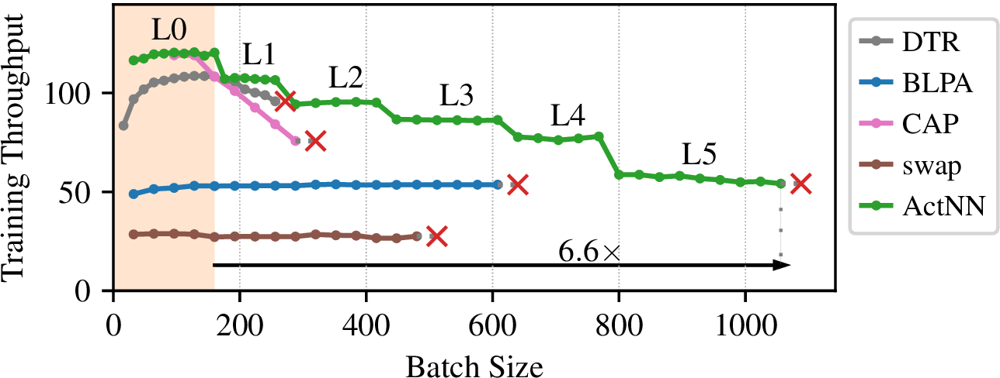

# ActNN-PaddlePaddle: Activation Compressed Training

This is a project repository based on [ActNN: Reducing Training Memory Footprint via 2-Bit Activation Compressed Training](https://arxiv.org/abs/2104.14129) by Jianfei Chen\*, Lianmin Zheng\*, Zhewei Yao, Dequan Wang, Ion Stoica, Michael W. Mahoney, and Joseph E. Gonzalez.

**TL; DR.**
ActNN-PaddlePaddle is a PaddlePaddle library for memory-efficient training. It reduces the training memory footprint by compressing the saved activations. ActNN is implemented as a collection of memory-saving layers. These layers have an identical interface to their PaddlePaddle counterparts.

## Abstract
The increasing size of neural network models has been critical for improvements in their accuracy, but device memory is not growing at the same rate. This creates fundamental challenges for training neural networks within limited memory environments. In this work, we propose ActNN, a memory-efficient training framework that stores randomly quantized activations for back propagation. We prove the convergence of ActNN for general network architectures, and we characterize the impact of quantization on the convergence via an exact expression for the gradient variance. Using our theory, we propose novel mixed-precision quantization strategies that exploit the activation's heterogeneity across feature dimensions, samples, and layers. These techniques can be readily applied to existing dynamic graph frameworks, such as PaddlePaddle, simply by substituting the layers. We evaluate ActNN on mainstream computer vision models for classification, detection, and segmentation tasks. On all these tasks, ActNN compresses the activation to 2 bits on average, with negligible accuracy loss. ActNN reduces the memory footprint of the activation by 12×, and it enables training with a 6.6× to 14× larger batch size.


*Batch size vs. training throughput on ResNet-50. Red cross mark means out-of-memory. The shaded yellow region denotes the possible batch sizes with full precision training. ActNN achieves significantly larger maximum batch size over other state-of-the-art systems and displays a nontrivial trade-off curve.*

## Install
- Requirements
```
paddlepaddle-gpu>=2.0.0
```
GPU and CUDA Toolkit are required.

- Build
```bash
git clone git@github.com:thu-ml/ACTNN-PaddlePaddle.git
cd actnn/actnn
pip install -v -e .
```


### Basic Usage
- Step1: Configure the optimization level  
PaddlePaddle provides several optimization levels to control the trade-off between memory saving and computational overhead.
You can set the optimization level by
```python
import paddle
import actnn
# available choices are ["L0", "L1", "L2", "L3", "L4", "L5"]
actnn.set_optimization_level("L3")
```
See [set_optimization_level](actnn/actnn/conf.py) for more details.

- Step2: Convert the model to use ActNN's layers.  
```python
model = actnn.QModule(model)
```
**Note**:
1. Convert the model _before_ calling `.cuda()`.
2. Set the optimization level _before_ invoking `actnn.QModule` or constructing any ActNN layers.
3. Automatic model conversion only works with standard PaddlePaddle layers.
Please use the modules (`paddle.nn.Conv2d`, `paddle.nn.ReLU`, etc.), not the functions (`paddle.nn.functional.conv2d`, `paddle.nn.functional.relu`).  


- Step3: Print the model to confirm that all the modules (Conv2d, ReLU, BatchNorm) are correctly converted to ActNN layers.
```python
print(model)    # Should be actnn.QConv2d, actnn.QBatchNorm2d, etc.
``` 


### Advanced Features
- Convert the model manually.  
ActNN is implemented as a collection of memory-saving layers, including `actnn.qconv1d, qconv2d, qconv3d, qconv_transpose1d, qconv_transpose2d, qconv_transpose3d,
    qbatch_norm1d, qbatch_norm2d, qbatch_norm3d, qlinear, qrelu, qsync_batch_norm, qmax_pool2d`. These layers have identical interface to their PyTorch counterparts.
You can construct the model manually using these layers as the building blocks.
See `ResNetBuilder` and `resnet_configs` in [image_classification/image_classification/resnet.py](image_classification/image_classification/resnet.py) for example.
- (Optional) Change the data loader  
If you want to use per-sample gradient information for adaptive quantization,
you have to update the dataloader to return sample indices.
In addition, you have to update the configurations.
```python
from actnn import config, QScheme
config.use_gradient = True
QScheme.num_samples = 1300000   # the size of training set
```
You can find sample code in the above script.
- (Beta) Mixed precision training   
ActNN works seamlessly with [Amp](https://github.com/NVIDIA/apex), please see [image_classification](image_classification/) for an example.

## Examples

### Image Classification
See [image_classification](image_classification/)


## FAQ
1. Does PaddlePaddle support CPU training with ActNN?  
Currently, ActNN-PaddlePaddle only supports CUDA.

2. Accuracy degradation / diverged training with ActNN.  
ActNN applies lossy compression to the activations. In some challenging cases, our default compression strategy might be too aggressive.
In this case, you may try more conservative compression strategies (which consume more memory):
    - 4-bit per-group quantization  
   ```python
   actnn.set_optimization_level("L2")
   ```
   - 8-bit per-group quantization
   ```python
   actnn.set_optimization_level("L2")
   actnn.config.activation_compression_bits = [8]
   ```
    If none of these works, you may report to us by creating an issue.

## Citation

If the ActNN library is helpful in your research, please consider citing our paper:

```bibtex
@inproceedings{chen2021actnn,
  title={ActNN: Reducing Training Memory Footprint via 2-Bit Activation Compressed Training},
  author={Chen, Jianfei and Zheng, Lianmin and Yao, Zhewei and Wang, Dequan and Stoica, Ion and Mahoney, Michael W and Gonzalez, Joseph E},
  booktitle={International Conference on Machine Learning},
  year={2021}
}
``` 
